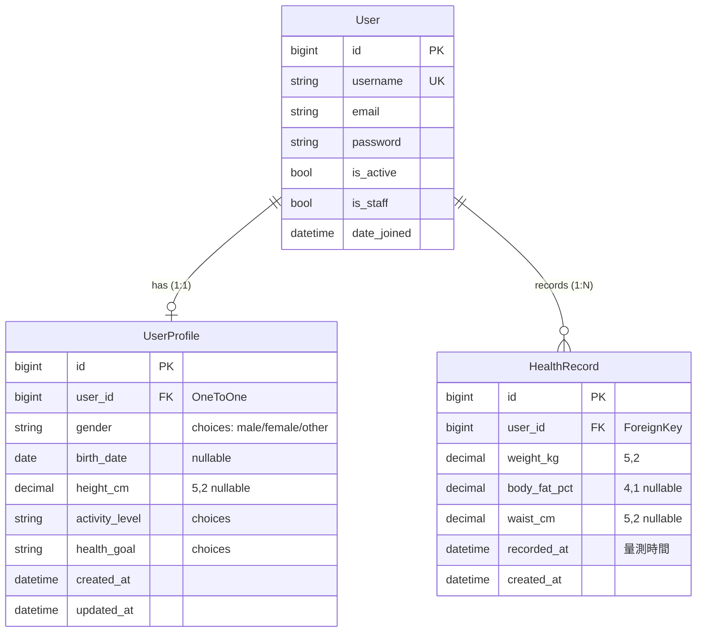

# 資料模型與 Migration（Database）

> 回到 [README](../README.md) ｜ 相關：[architecture.md](architecture.md)、[commands.md](commands.md)

---

## 1. 概觀

- **DBMS**：PostgreSQL 16
- **連線**：透過 `DATABASE_URL` 環境變數（容器內 host 為 `db`）
- **時區**：`TIME_ZONE = "Asia/Taipei"`、`USE_TZ = True`——DB 一律存 UTC，顯示時轉台北時間
- **交易**：`ATOMIC_REQUESTS = False`，由 application 層以明確 `transaction.atomic()` 控制（理由見 [architecture.md](architecture.md#5-其他關鍵決策)）

---

## 2. ER 圖



> `BMICategory` 是 `domain.py` 中的 `StrEnum`（領域值物件），**非資料表**；BMI 為跨實體計算結果，不持久化（見 [architecture.md](architecture.md#3-簽名級設計決策age-在-modelbmi-不在-model)）。

---

## 3. 模型細節

### `accounts.User`

自訂 User，繼承 `AbstractUser`。第一天即鎖定 `AUTH_USER_MODEL = "accounts.User"`，避免日後更換的 migration 災難。

```python
class User(AbstractUser):
    def __str__(self) -> str:
        return self.username
```

### `accounts.UserProfile`

使用者的**穩定領域屬性**，與 User 為 OneToOne。

| 欄位 | 型別 | 說明 |
| --- | --- | --- |
| `user` | OneToOneField → User | `related_name="profile"`，CASCADE |
| `gender` | CharField(choices) | male / female / other |
| `birth_date` | DateField (null) | 用於計算 `age` |
| `height_cm` | DecimalField(5,2) (null) | 用於計算 BMI |
| `activity_level` | CharField(choices) | sedentary / light / moderate / active |
| `health_goal` | CharField(choices) | lose_fat / gain_muscle / maintain |
| `created_at` / `updated_at` | DateTimeField | `auto_now_add` / `auto_now` |

提供 `age` 計算屬性（純計算、單一實體，故放 model）：

```python
@property
def age(self) -> int | None:
    if self.birth_date is None:
        return None
    today = date.today()
    before_birthday = (today.month, today.day) < (self.birth_date.month, self.birth_date.day)
    return today.year - self.birth_date.year - int(before_birthday)
```

### `health.HealthRecord`

使用者的**時序量測資料**，與 User 為 ForeignKey（一對多）。

| 欄位 | 型別 | 說明 |
| --- | --- | --- |
| `user` | ForeignKey → User | `related_name="health_records"`，CASCADE，`verbose_name="使用者"` |
| `weight_kg` | DecimalField(5,2) | `verbose_name="體重"` |
| `body_fat_pct` | DecimalField(4,1) (null) | `verbose_name="體脂肪率"` |
| `waist_cm` | DecimalField(5,2) (null) | `verbose_name="腰圍"` |
| `recorded_at` | DateTimeField | `verbose_name="測量時間"`；無預設，容許回填過去量測 |
| `created_at` | DateTimeField | `auto_now_add` |

**為何用 `DecimalField` 而非 `FloatField`**：體重、體脂等量測值需精確小數，`float` 的二進位浮點誤差不適合（會出現 70.1 變 70.099999…）。

### Custom QuerySet / Manager

讀取邏輯之後集中於 selectors，此處只放可重用的查詢片段（building blocks）：

```python
class HealthRecordQuerySet(models.QuerySet["HealthRecord"]):
    def for_user(self, user: User) -> "HealthRecordQuerySet":
        return self.filter(user=user)

    def chronological(self) -> "HealthRecordQuerySet":
        return self.order_by("recorded_at")

    def most_recent_first(self) -> "HealthRecordQuerySet":
        return self.order_by("-recorded_at")
```

用法可串接：`HealthRecord.objects.for_user(u).most_recent_first()`，且型別可被 mypy 認得。

---

## 4. 索引策略

`HealthRecord` 設複合索引 `(user, recorded_at)`：

```python
class Meta:
    ordering = ["-recorded_at"]
    indexes = [models.Index(fields=["user", "-recorded_at"])]
```

**理由**：兩個主要查詢——「抓某使用者最新一筆」與「畫某使用者趨勢」——都吃這個複合索引，避免全表掃描與 N+1。降冪 `-recorded_at` 對「最新優先」的主流查詢最佳。

> 隨資料量成長，未來可評估 partial index 或 BRIN（time-series 友善），屆時於 M6 處理。

---

## 5. Migration

### 常用指令

```bash
# 產生 migration（修改 model 後）
docker compose run --rm web python manage.py makemigrations

# 套用 migration
docker compose exec web python manage.py migrate

# 檢查特定 app
docker compose run --rm web python manage.py makemigrations health

# 顯示 migration 狀態
docker compose run --rm web python manage.py showmigrations
```

> `makemigrations` 本身不需連 DB（只比對 model vs migration 檔）。若以 `--no-deps` 執行且 db 未啟動，會出現 `failed to resolve host 'db'` 的 `RuntimeWarning`，但仍會正常輸出結果，無害。需要實際套用時（`migrate`）才需 db 啟動。

### Migration Safety（CI 閘門）

CI 會執行：

```bash
python manage.py makemigrations --check --dry-run
```

若有人改了 model 卻忘了產生 migration，此指令以非零碼結束，PR 直接紅燈。這是對「migration 漂移」最有效的防線。詳見 [code_quality.md](code_quality.md) 與 [deployment.md](deployment.md)。

### Migration 安全演進原則（後續里程碑）

當資料表已有正式資料後：

- **加欄位**：給 `null=True` 或 `default`，避免鎖表過久。
- **改欄位 / 刪欄位**：分多次部署（先相容並存，再清理），確保 backward compatibility 與 zero-downtime。
- **大表加索引**：PostgreSQL 可用 `CREATE INDEX CONCURRENTLY`（Django 的 `AddIndexConcurrently`）避免長時間鎖。

---

## 6. 直接操作資料庫

```bash
# 進入 psql
docker compose exec db psql -U nutrition -d nutrition

# 列出資料表
docker compose exec db psql -U nutrition -d nutrition -c "\dt"

# Django shell（ORM 互動）
docker compose run --rm web python manage.py shell
```

更多指令見 [commands.md](commands.md#postgresql)。
