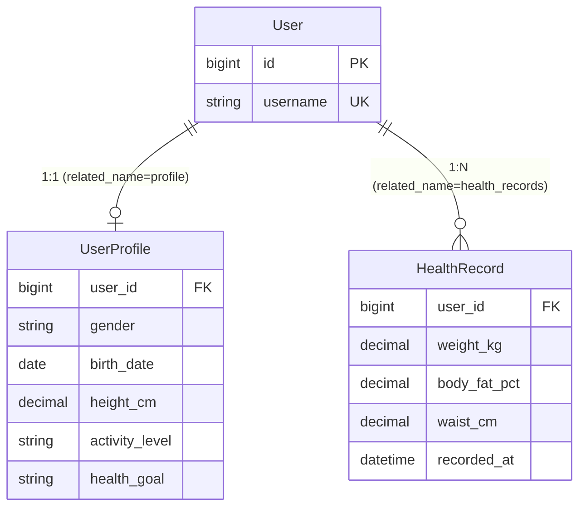

# 開發者指南（Developer Guide）

> 回到 [README](../README.md)
> 新進開發者的單一上手文件。讀完這份 + [setup.md](setup.md) 即可開始貢獻。

---

## 目錄

1. [專案架構介紹](#1-專案架構介紹)
2. [資料流說明](#2-資料流說明)
3. [Django App 職責](#3-django-app-職責)
4. [Model 關聯圖](#4-model-關聯圖)
5. [開發流程](#5-開發流程)
6. [Commit 流程](#6-commit-流程)
7. [Branch 策略](#7-branch-策略)
8. [Code Review 流程](#8-code-review-流程)
9. [常見問題與排錯指南](#9-常見問題與排錯指南)

---

## 1. 專案架構介紹

本專案是一個 **AI 營養師健康管理平台**，採 **Modular Monolith** + **務實分層架構**。

**一句話理解架構**：business logic 不散落在各處——純規則進 `domain.py`、寫入用例進 `services.py`、讀取組裝進 `selectors.py`、HTTP I/O 留在 `views/serializers`、資料結構在 `models.py`。

**為何不是微服務 / 不是滿配 Hexagonal**：單人開發、domain 未穩定的階段，這些是過度設計。我們先做出能跑的 vertical slice、親身體驗每個模式為何存在，再逐步硬化。真正引入 ports-adapters 的時機是 M4（LLM provider 抽換）。

完整架構與設計決策見 [architecture.md](architecture.md)。

### 技術棧速覽

Python 3.12 / Django 5.2 LTS / DRF / PostgreSQL 16 / Redis 7 / uv / Ruff / mypy(strict) / pytest / Docker。詳見 [README](../README.md#技術棧-tech-stack)。

---

## 2. 資料流說明

以「新增一筆體重量測」與「查詢最新 BMI」為例（M1.4 完整實作後）：

### 寫入流（新增量測）

```
Client ──POST /api/health/records/──▶ View（Interface）
                                        │ 解析請求、權限檢查
                                        ▼
                                     Serializer：欄位驗證（純 I/O）
                                        │
                                        ▼
                                     service.record_measurement()（Application）
                                        │ 業務驗證
                                        │ with transaction.atomic():  ← 窄交易
                                        │     HealthRecord.objects.create(...)
                                        ▼
                                     PostgreSQL（Infrastructure）
```

### 讀取流（查最新 BMI）

```
Client ──GET /api/health/bmi/──▶ View（Interface）
                                   │
                                   ▼
                                selector.latest_bmi(user)（Application）
                                   │ 1. 取 user.profile.height_cm（Infra）
                                   │ 2. 取最新 HealthRecord.weight_kg（Infra）
                                   │ 3. compute_bmi(weight, height)（Domain 純函式）
                                   │ 4. classify_bmi(bmi)（Domain）
                                   ▼
                                回傳 BMIResult → Serializer → JSON
```

**注意資料流向**：View 不直接碰 ORM 做業務查詢，而是委派給 selector / service；domain 純函式不知道 DB 存在。這條紀律是維護性的關鍵。

健康檢查的資料流（現有）：`GET /readyz/` → `core/healthcheck.readiness` → 檢查 DB（`SELECT 1`）+ cache（set/get）→ 200/503。

---

## 3. Django App 職責

| App / 目錄 | 職責 | 主要內容 | 狀態 |
| --- | --- | --- | --- |
| `apps/accounts` | 使用者身分與領域屬性 | `User`（自訂）、`UserProfile`（gender/birth_date/height/activity/goal、`age` property） | ✅ 模型 |
| `apps/health` | 健康量測與指標 | `HealthRecord`（time-series）、`HealthRecordQuerySet`、`domain.py`（BMI 計算） | ✅ 模型 + domain |
| `core` | 跨領域共用 | `healthcheck.py`（liveness/readiness）、共用測試 | ✅ |
| `config` | 組態（非 business code） | settings 分層、urls、wsgi/asgi | ✅ |
| `apps/diary` | 飲食紀錄 | — | ⬜ M2 |
| `apps/foods` | 食物知識庫 | — | ⬜ M3 |
| `apps/ai` | LLM 營養分析 | `AIProvider` port + adapter | ⬜ M4 |
| `apps/knowledge_base` | RAG / 向量檢索 | — | ⬜ M5 |

**App 內標準結構**（隨里程碑長出）：

```
apps/<app>/
├── domain.py        Domain：純規則 / 公式
├── models.py        Infrastructure：資料結構 + custom QuerySet
├── selectors.py     Application：讀取 / 組裝
├── services.py      Application：寫入 / 交易
├── serializers.py   Interface：I/O
├── views.py         Interface：HTTP
├── admin.py         glue
├── tests.py
└── migrations/
```

---

## 4. Model 關聯圖



**關聯重點**：

- `User : UserProfile` = 1:1（穩定屬性）。
- `User : HealthRecord` = 1:N（時序資料，可畫趨勢）。
- BMI 為 `UserProfile.height_cm` × `HealthRecord.weight_kg` 的**跨實體計算**，不持久化（放 selector，不放 model）。

欄位細節與索引見 [database.md](database.md)。

---

## 5. 開發流程

```
1. git switch main && git pull
2. git switch -c feature/<簡述>
3. 開發（依「程式碼放哪一層」原則，見下表）
4. 四道品質閘門（本機）：
     ruff check --fix .  →  ruff format .  →  mypy .  →  pytest -q
5. git commit + push
6. 開 PR → CI 綠燈 → review → merge
```

**程式碼放哪一層**：

| 是… | 放哪 |
| --- | --- |
| 純計算、單一實體 | model `@property` / `domain.py` |
| 跨實體、需查詢 | `selectors.py` |
| 寫入、需交易 | `services.py` |
| HTTP I/O | `views.py` / `serializers.py` |

完整開發流程見 [development.md](development.md)。

---

## 6. Commit 流程

```bash
git add .
git commit -m "M1.x: <動詞開頭簡述>"
git push -u origin <branch>
```

慣例：里程碑前綴 + 動詞開頭、聚焦一件事。例：`M1.2: add selectors for cross-entity BMI`。

---

## 7. Branch 策略

- `main`：永遠可部署、CI 須綠。
- `feature/*`：功能開發，從 main 切出，PR 合回。
- `fix/*`：修錯。

保持 branch 短命、PR 小顆。詳見 [development.md](development.md#5-branch-策略)。

---

## 8. Code Review 流程

PR 開啟後，**CI 必須綠燈**方可合併。Review 檢查清單：

- [ ] **分層正確**：business logic 沒漏進 view / serializer / signal？純規則在 domain？跨實體在 selector？
- [ ] **ORM 健康**：有無 N+1（缺 `select_related`/`prefetch_related`）？查詢有對應索引？
- [ ] **交易範圍**：`transaction.atomic()` 是否只包住寫 DB 那幾行（不含長 I/O）？
- [ ] **Migration 安全**：是否 backward compatible？大表操作是否會鎖？（CI 的 `makemigrations --check` 已擋「漏產生」）
- [ ] **測試涵蓋**：domain 有純測？需 DB 者有整合測？
- [ ] **型別**：通過 mypy strict？無濫用 `Any`？
- [ ] **無 magic**：避免 signal、避免隱性副作用。

通過後建議 squash merge，刪除 feature branch。

---

## 9. 常見問題與排錯指南

本專案建置過程踩過的坑與解法，依「root cause」分類。多數錯誤訊息其實已直接點出原因，**先讀錯誤訊息再動手**。

### 9.1 環境 / Windows

| 症狀 | Root cause | 解法 |
| --- | --- | --- |
| `working directory 'C:/Program Files/Git/app' is invalid` | Git Bash 把 `/app` 自動轉成 Windows 路徑 | 指令前加 `MSYS_NO_PATHCONV=1`；或改用 WSL2 |
| `curl /readyz/` 行為怪異 / 404 路徑被改 | 同上，`/readyz/` 被轉換 | `MSYS_NO_PATHCONV=1 curl ...` |
| autoreload 不觸發、bind mount 很慢 | repo 放在 `/mnt/c|d/...`（掛載 Windows 磁碟） | 移到 WSL2 的 `~/projects/...` |
| 容器內 shell script 執行失敗（`\r` 錯誤） | Windows CRLF 換行 | `.gitattributes` 已設 `eol=lf`；確認編輯器輸出 LF |

### 9.2 Django 設定 / App

| 症狀 | Root cause | 解法 |
| --- | --- | --- |
| `No module named 'config.settings.dev'; 'config.settings' is not a package` | `startproject` 產生的是單檔 `settings.py`，未拆成套件 | 建立 `config/settings/` 套件（`__init__.py` + base/dev/prod），刪除 `settings.py` |
| `Cannot import 'accounts'. Check that '...AppConfig.name' is correct` | `apps.py` 的 `name` 是裸名 `"accounts"`，但 app 在 `apps/accounts/` | 改 `name = "apps.accounts"` + `label = "accounts"` |
| `404` on `/readyz/`，URLconf 只有 `admin/` | `config/urls.py` 仍是預設版，未加 health 路由 | 覆蓋 `urls.py`，加入 `/healthz/` `/readyz/` |
| `failed to resolve host 'db'`（RuntimeWarning，makemigrations） | 以 `--no-deps` 跑、db 未啟動 | 無害；makemigrations 不需 DB。需 migrate 時用 `docker compose up -d` 起 db |

### 9.3 程式邏輯

| 症狀 | Root cause | 解法 |
| --- | --- | --- |
| mypy `"self" parameter missing for a non-static method` + import 失敗 | 函式被誤縮排進 class（變成沒有 self 的 method） | 將純函式移回 class 外、頂格（module level） |
| pytest `AssertionError: 24.2 == 23.5` | **測試斷言錯**，非程式錯（輸入改了期望值沒改） | 手算驗證（70/1.7²=24.2）→ 修正測試期望值 |

### 9.4 Lint / 型別（多為設定，非真 bug）

| 症狀 | 性質 | 解法 |
| --- | --- | --- |
| `RUF002 ambiguous （／，／；`（中文全形標點） | 誤報（中文 codebase） | `ignore = ["RUF001","RUF002","RUF003"]` |
| `RUF012 Mutable default` 於 `Meta.ordering/indexes` | 誤報（Django 慣例） | `per-file-ignores: "**/models.py" = ["RUF012"]` |
| `E501` / `RUF012` 於 migration 檔 | 自動生成檔不該 lint | `extend-exclude = ["**/migrations/**"]` |
| mypy `Skipping analyzing "environ"` | 第三方無 stub | per-module override `ignore_missing_imports` |
| mypy `Missing type arguments for "ModelAdmin"` | strict 泛型，但下標 runtime 會爆 | per-module override 對 `apps.*.admin` 關 `type-arg` |
| mypy `exclude` 設了卻沒生效 | `exclude` 對命令列明確路徑（`mypy .`）無效 | 改用 per-module override，或點名套件 `mypy apps core config` |

### 9.5 Git

| 症狀 | Root cause | 解法 |
| --- | --- | --- |
| `push rejected (fetch first)` | 遠端 repo 建立時自動初始化檔案，與本機無共同祖先 | `git pull origin main --allow-unrelated-histories` 後再 push |
| `.gitignore` 出現 `<<<<<<< / ======= / >>>>>>>` | merge 衝突 | 保留兩邊互補內容、刪除衝突記號、`git add` 後 commit |

> **通用心法**：閘門報錯先分辨 **signal（真 bug，修程式）** vs **noise（框架慣例/第三方/設定，調 `pyproject.toml`）**。本專案 lint/型別的設定決策（含每條停用規則的理由）見 [code_quality.md](code_quality.md)。

---

> 還有問題？先查 [commands.md](commands.md) 確認指令用法，或 [setup.md](setup.md) 重新檢視環境。
